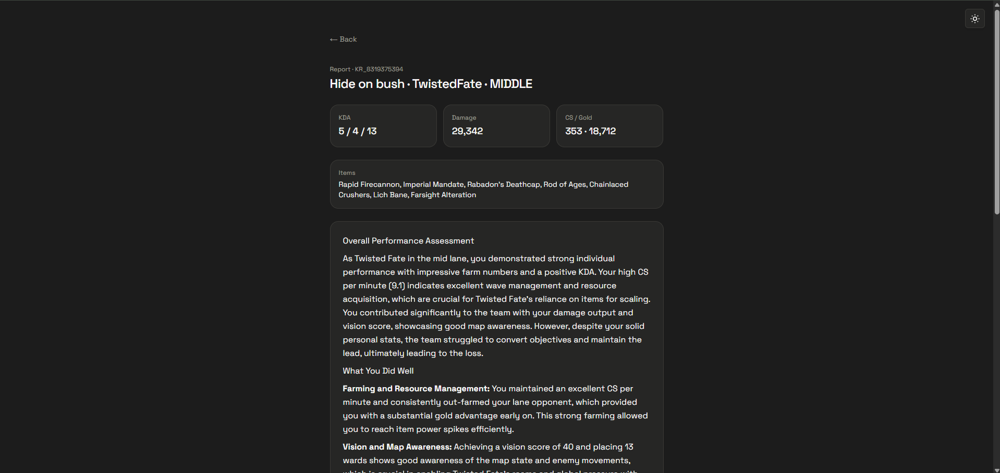
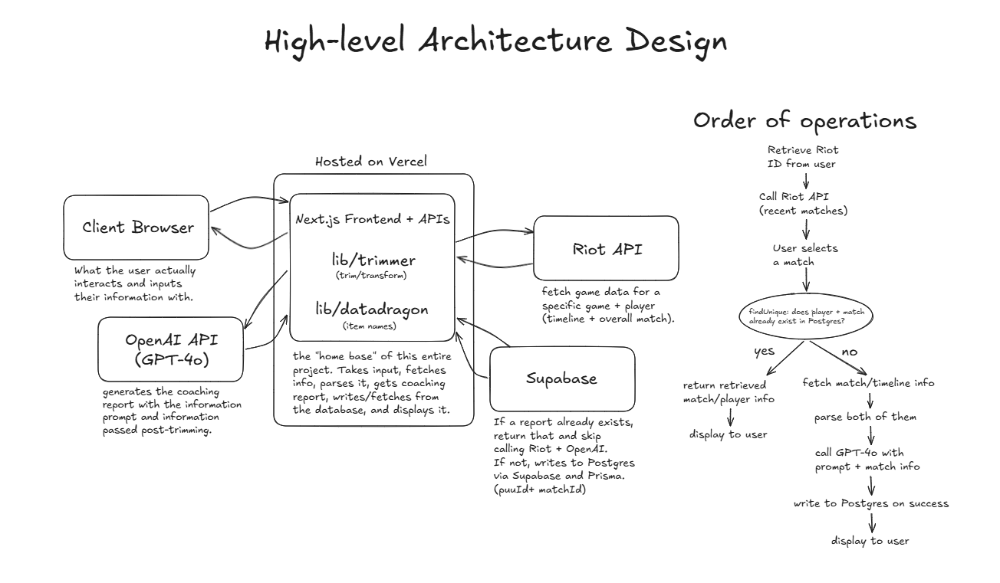

# Replayd

### **AI coaching reports for your ranked League of Legends games.**

Replayd takes your Riot ID + region, fetches your match and timeline data from the Riot Games API, then parses the necessary information before sending it off to GPT-4o for a quick and honest review. Completed reports are cached in Postgres, so repeat lookups will skip calling both Riot and OpenAI entirely.

Try a cached sample (no Riot ID required) on the live demo: https://replaydcoach.vercel.app/

## Example report for Faker:

## High-level Architecture:

## Design choices I made
- **Trimming before prompting** — Obvious but also incredibly important choice here. Making sure that the input isn't diluting attention or spending a crazy amount of tokens. Raw match + timeline JSON can be huge, and dumping that into a model just doesn't make much sense. Makes sure that the LLM only gets information that we care about in a coaching report (gold/CS, lane diffs, death timers, objective timers, etc).

- **Caching by both matchId and puuid (not just matchId)** — Wasn't immediately clear to me, but really should've been. There are ten players in a game and coaching only relates to one of those players. Cache hits would return the report that was related to the specific matchId, but not necessarily the specific player. This eliminates the case where multiple players from the same game would request a report, but every player after the first to request would receive the first player's report.

## Stack
Next.js - TypeScript - Tailwind - Motion - OpenAI - PostgreSQL - Prisma - Vercel
